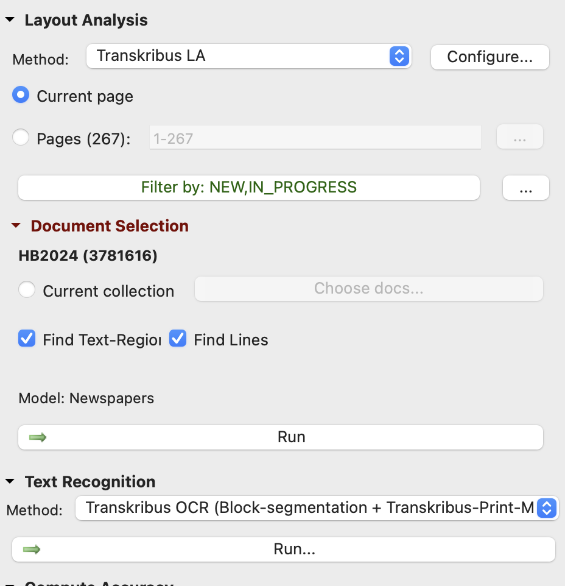

# method.info
#### 14345
----
## prerequisites
- import .tiff to mac photos, export .png (big, most compatibel), ca. 150-700 KB each
- upload .png folder (267 items) to transkribus
- edit metadata
- customise tagsystem
## TODO
- [ ] refine tags to applying to finalised TEI scheme according HA
  - [ ] attributes for each
- [ ] anonymise names
## process
### OCR
configuration:

### annotation
- assign tags to transcript passages
### export
### work with text
#### NE anonymisation
- script: [NE_anonymise.R](scripts/NE_anonymise.R) (cf. <https://github.com/lipogg/textanalyse-mit-r/blob/main/10-NER.Rmd>)